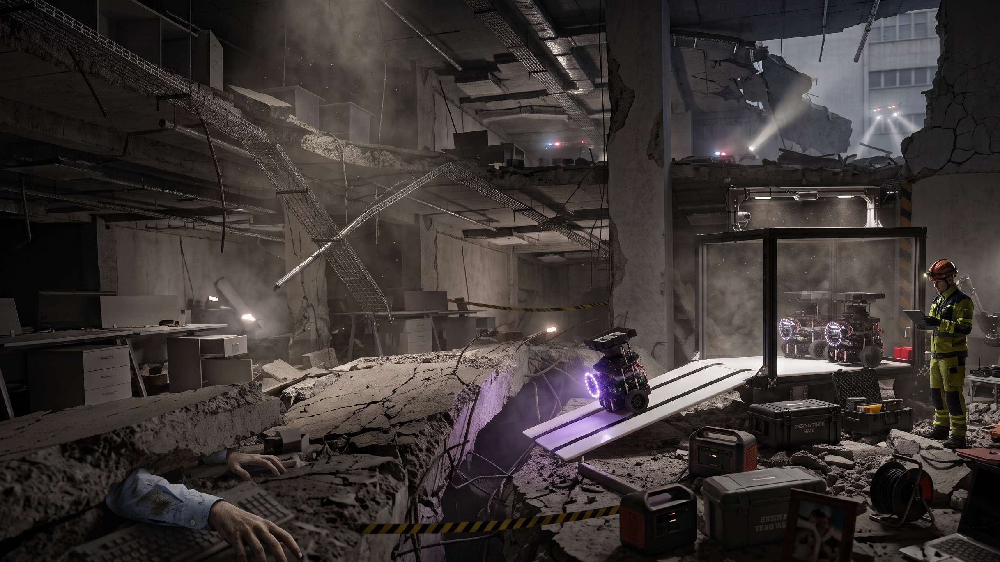
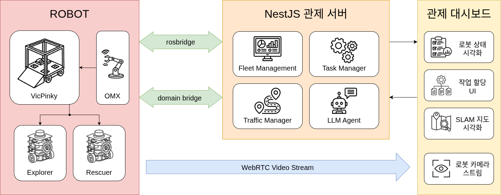
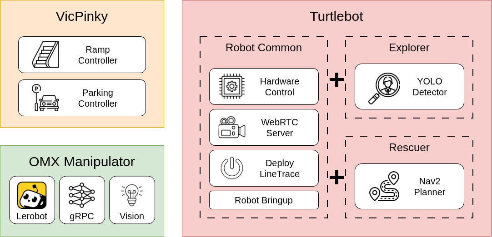
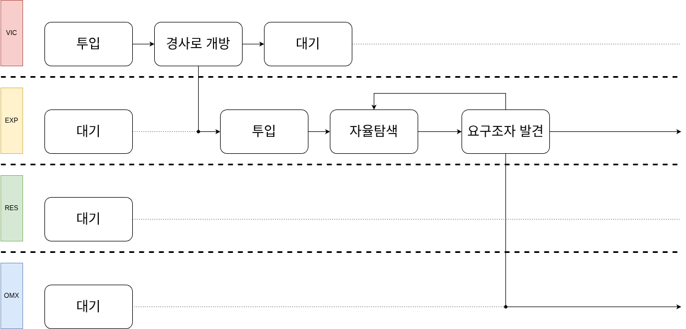
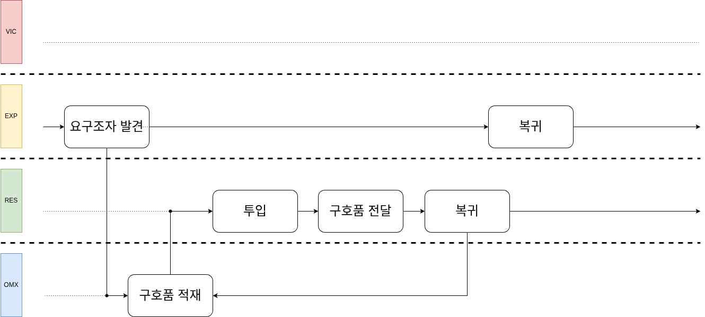
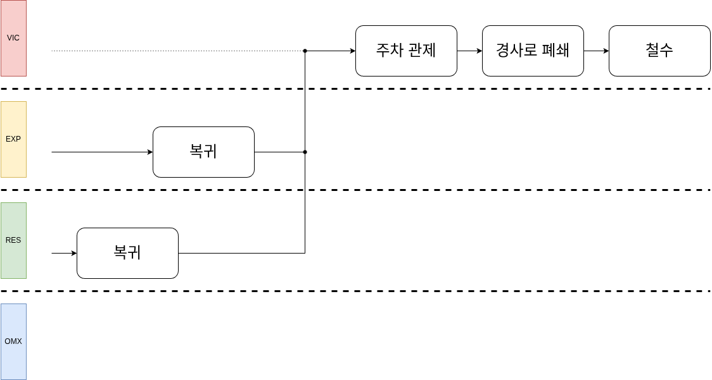
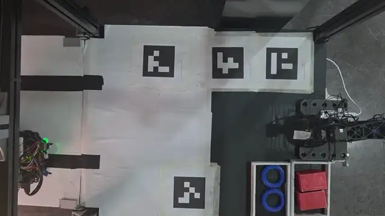
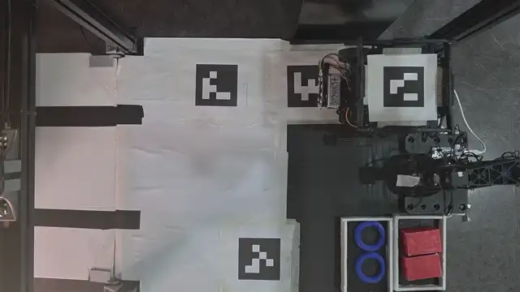
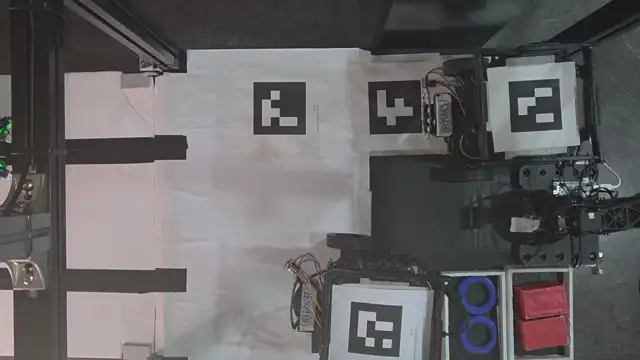

# VicPinky Carrier
> 다중 로봇 협력형 재난 현장 구호활동 조력 로봇 시스템

## 목차
- [Demo](#demo)
- [Overview](#overview)
- [Tech Stack](#tech-stack)
- [System Architecture](#system-architecture)
- [Key Features](#key-features)
  - [Turtlebot](#turtlebot)
  - [VicPinky](#vicpinky)
  - [OMX Manipulator](#omx-manipulator)
  - [FMS Dashboard](#fms-dashboard)
- [Quick Start Guide](#quick-start-guide)
- [팀원 소개 및 역할](#팀원-소개-및-역할)
- [License](#license)

## Demo
[](https://youtu.be/osSID7h3-i8)

이미지를 클릭해 데모 영상을 시청할 수 있습니다.


## Overview
VicPinky Carrier는 건물 붕괴 등 인력 투입이 어려운 협소 공간에 소형 로봇을 다수 투입하여 내부를 수색해 요구조자를 식별하고 구호품 전달이 가능한 구호 로봇 시스템입니다. 붕괴 현장에 고립된 요구조자를 탐색해 발견 시점을 앞당기고, 구호품을 전달해 골든타임을 연장하여 인명 구조 활동을 조력하는 것이 목적입니다.


## Tech Stack
| 분류 | 기술 |
|---|---|
| Environment | Python3, Ubuntu 24.04 LTS |
| Robotics | ROS2 Jazzy, Nav2, slam_toolbox, AMCL |
| Perception | OpenCV, Ultralytics YOLO |
| Web & Communication | React, NestJS, TypeScript, Socket.IO, rosbridge, WebRTC |
| Hardware | Raspberry Pi 4B, ROBOTIS DYNAMIXEL |
| Robots | PinkLAB VicPinky, ROBOTIS TurtleBot3, ROBOTIS OpenManipulator-X |


## System Architecture
### 전체 시스템 다이어그램


시스템은 FMS 관제 서버를 중심으로 하는 중앙 집중형 구조입니다. NestJS 백엔드가 rosbridge를 통해 VicPinky, 터틀봇 등 각 로봇의 ROS2 노드와 연결되어 상태 수집과 명령 전달을 담당하고, React 프론트엔드와는 Socket.IO로 실시간 통신하여 관제 화면을 제공합니다. OMX 매니퓰레이터의 추론 연산은 호스트 PC의 GPU에서 분리 수행되며, 라즈베리파이가 로봇 측 실시간 제어를 담당하는 분산 구조로 동작합니다.

### 로봇 다이어그램


투입되는 로봇은 세 종류로 구성됩니다. VicPinky는 터틀봇과 구호품을 적재해 현장까지 운송하는 모선 역할로, DYNAMIXEL 구동 경사로와 3대의 카메라(전방, 내부, 추론), OMX 매니퓰레이터를 탑재합니다. 터틀봇은 임무에 따라 탐사용과 구호용으로 나뉘며, 카메라, 전조등, 마이크, 스피커, IR 센서, 상단 ArUco 마커를 갖추도록 개조되었습니다. OMX 매니퓰레이터는 VicPinky 내부에 장착되어 구호용 터틀봇의 바구니에 구호품을 상차합니다.

### 동작 시퀀스

VicPinky가 터틀봇과 구호품을 적재한 채 재난 현장 인근 거점까지 이동한 뒤 경사로를 개방하여 탐사용 터틀봇을 투입합니다. 투입된 터틀봇은 프론티어 기반 알고리즘으로 내부를 자율 탐사하며 SLAM으로 지도를 생성하고, 탐사 상황은 관제 서버로 실시간 공유됩니다.


탐사 중 YOLO 모델이 요구조자를 인식하면 AMCL로 추정한 위치를 지도에 표기하고 관제 서버에 보고합니다. 이를 수신한 관제는 구호 임무를 생성하고, 구호용 터틀봇 위에 OMX 매니퓰레이터가 모방학습 기반 추론으로 구호품을 자율 상차합니다.


상차를 마친 구호용 터틀봇은 공유된 지도와 요구조자 위치를 기반으로 최단 경로를 주행하여 구호품을 전달합니다. 임무를 마친 터틀봇은 VicPinky로 복귀하며, 임무를 마쳤다면 내부로 회수하여 현장에서 철수합니다.


## Key Features
### Turtlebot
<div align="center">
  <table>
    <tr>
      <td align="center">
        <br/>
        <sub><b>터틀봇</b></sub>
      </td>
    </tr>
  </table>
</div>
협소 공간에 투입되어 요구조자를 탐색하거나 구호품을 전달할 수 있는 자율주행 로봇입니다. 수행 목적에 따라 탐사용과 구호용으로 구분되어 운용됩니다. 탐사용 터틀봇은 가장 먼저 현장에 투입되어 내부를 자율적으로 탐사하며, 요구조자를 식별하면 구호용 터틀봇이 관제 서버를 통해 그 위치로 이동하여 구호품을 전달합니다.

https://github.com/user-attachments/assets/6f7efe83-0220-42bc-89b3-1b40f406feb6

자율 탐사는 프론티어 기반 알고리즘으로 동작합니다. 프론티어가 가장 많은 방향을 우선적으로 이동하며, 미탐사 영역이 남지 않을 때까지 탐색을 반복하여 내부 전체를 지도화합니다.

<div align="center">
  <table>
    <tr>
      <td align="center" width="50%">
        <br/>
        <sub><b>전조등 OFF</b></sub>
      </td>
      <td align="center" width="50%">
        <br/>
        <sub><b>전조등 ON</b></sub>
      </td>
    </tr>
    <tr>
      <td align="center" width="50%">
        <br/>
        <sub><b>스피커</b></sub>
      </td>
      <td align="center" width="50%">
        <br/>
        <sub><b>IR 센서</b></sub>
      </td>
    </tr>
    <tr>
      <td align="center" width="50%">
        <br/>
        <sub><b>상단 arUco 마커</b></sub>
      </td>
      <td align="center" width="50%">
        <br/>
        <sub><b>구호품 적재 상태</b></sub>
      </td>
    </tr>
  </table>
</div>
터틀봇의 하드웨어는 재난 현장에 적합하게 카메라, 전조등, 마이크 및 스피커를 탑재한 사양으로 개조되었습니다. 전조등으로 저조도 환경에서도 시야를 확보하고, 마이크와 스피커를 통한 STT/TTS로 요구조자와 간단한 의사소통을 수행할 수 있도록 하였습니다.

<div align="center">
  <table>
    <tr>
      <td align="center">
        <br/>
        <sub><b>YOLO 요구조자 탐지</b></sub>
      </td>
    </tr>
  </table>
</div>
요구조자 인식은 카메라 영상을 입력으로 YOLO 모델을 로컬에서 구동해 추론하는 방식입니다. 요구조자가 화면에 인식되면 관제 서버로 보고하는 동시에, SLAM으로 생성한 지도 위에 AMCL로 추정한 위치를 표기하여 구호용 터틀봇이 참고하여 이동할 수 있게 합니다.

### VicPinky
<div align="center">
  <table>
    <tr>
      <td align="center" width="50%">
        <br/>
        <sub><b>경사로 닫힘</b></sub>
      </td>
      <td align="center" width="50%">
        <br/>
        <sub><b>경사로 열림</b></sub>
      </td>
    </tr>
  </table>
</div>
터틀봇을 재난 현장으로 운송하는 중형 운반 플랫폼입니다. 현장에서는 거점 유지 역할을 수행하며, 경사로를 통해 터틀봇을 투입하거나 회수합니다. 내부에는 구호품을 적재할 수 있어 터틀봇을 통해 전달할 수 있습니다.

<div align="center">
  <table>
    <tr>
      <td align="center" width="33%">
        <br/>
        <sub><b>전방 카메라</b></sub>
      </td>
      <td align="center" width="33%">
        <br/>
        <sub><b>내부 카메라</b></sub>
      </td>
      <td align="center" width="33%">
        <br/>
        <sub><b>OMX 카메라</b></sub>
      </td>
    </tr>
  </table>
</div>
카메라는 3대가 장착되어 전방 카메라는 주행에 사용하고, 내부 카메라는 터틀봇이 승차했을 때 차내 위치를 제어하는 주차 관제용으로 사용합니다. OMX 카메라는 매니퓰레이터의 추론을 위해 사용합니다.

<div align="center">
  <table>
    <tr>
      <td align="center" width="50%">
        <br/>
        <sub><b>경사로 개폐</b></sub>
      </td>
      <td align="center" width="50%">
        <br/>
        <sub><b>라인트레이싱 회수</b></sub>
      </td>
    </tr>
  </table>
</div>
경사로는 장착된 DYNAMIXEL 모터 2개로 개폐하며, 경사로를 내려 터틀봇을 출입시킵니다. 터틀봇을 회수할 때는 경사로에 그어진 라인을 따라 라인트레이싱으로 올라오게 할 수 있습니다. 이렇게 진입한 터틀봇이 내부 카메라에 포착되면 주차 관제가 가능한 상태가 됩니다.

<div align="center">
  <table>
    <tr>
      <td align="center" width="33%">
        <br/>
        <sub><b>주차 관제 1</b></sub>
      </td>
      <td align="center" width="33%">
        <br/>
        <sub><b>주차 관제 2</b></sub>
      </td>
      <td align="center" width="33%">
        <br/>
        <sub><b>주차 관제 3</b></sub>
      </td>
    </tr>
  </table>
</div>
주차 관제는 OpenCV와 ArUco 마커 인식을 기반으로 터틀봇을 목표 지점까지 정밀 이동시키며, OMX 매니퓰레이터가 구호품을 상차하기 좋은 위치로 이동시킬 수도 있습니다.

### OMX Manipulator
<div align="center">
  <table>
    <tr>
      <td align="center" width="33%">
        <br/>
        <sub><b>좌측면</b></sub>
      </td>
      <td align="center" width="33%">
        <br/>
        <sub><b>후면</b></sub>
      </td>
      <td align="center" width="33%">
        <br/>
        <sub><b>우측면</b></sub>
      </td>
    </tr>
  </table>
</div>
터틀봇의 바구니에 구호품 상차를 수행하는 매니퓰레이터입니다.빅핑키의 주차 관제를 통해 터틀봇을 상차 위치에 정렬하면 그 위치를 기준으로 동작합니다. 사람의 조종 없이 모방학습으로 학습한 동작을 추론해 상차를 수행합니다.

<div align="center">
  <table>
    <tr>
      <td align="center">
        <br/>
        <sub><b>OMX 자율 상차 추론</b></sub>
      </td>
    </tr>
  </table>
</div>
추론은 비동기 분산 구조로 동작합니다. 빅핑키 내부에 추가로 설치된 라즈베리파이는 실시간 모터 제어와 카메라 처리를 담당하고, 무거운 추론 연산은 호스트 PC의 GPU로 분리해 네트워크로 통신하며 동작하도록 설계하였습니다. 전체 루프는 이벤트 기반으로 동작하여, 평소에는 대기하다가 관제로부터 추론 시작 명령을 받으면 해당 작업에 맞는 사전학습 모델을 불러와 동작합니다.

<div align="center">
  <table>
    <tr>
      <td align="center">
        <br/>
        <sub><b>OMX 추론 대시보드 화면</b></sub>
      </td>
    </tr>
  </table>
</div>

작업 완료 여부는 비전 인식으로 스스로 판단합니다. 상단부 카메라 영상을 HSV 색공간에서 분석해 구호품의 적재 여부와 중심 정렬 상태를 실시간으로 평가하며, 순간적인 조명 변화나 가려짐은 타이머 기반 필터링으로 걸러냅니다. 적재와 정렬 조건이 동시에 충족되면 목표 달성으로 판단해 추론 루프를 안전하게 종료하고 다시 대기 상태로 돌아갑니다.

### FMS Dashboard
<!-- TODO: 관제 대시보드 사진 추가 -->
현장의 상황을 파악하고 로봇들의 상태를 모니터링 및 제어할 수 있는 통합 관제 시스템입니다. 관제를 넘어 실제로 다중 로봇을 운용하는 Fleet Management System 역할을 수행할 수 있습니다. 

<!-- TODO: FMS 대시보드 사진 추가 -->
수집된 맵을 노드-엣지 그래프로 관리하며, 관리자나 AI가 태스크를 생성하면 적합한 로봇에 배차해 최단경로로 자동 주행시킵니다. 태스크의 전 과정은 자동으로 처리되며, 경로상 노드 점유를 감지해 충돌을 방지하고, 장애가 발생한 노드는 폐쇄해 경유 중인 로봇을 우회시키며, 로봇 연결 끊김, 위치 추정 실패, 로봇 전복 등 상황도 스스로 감지해 태스크를 스케줄링합니다. 

<!-- TODO: AI 기능 사진 추가 -->
<!-- TODO: WebRTC 사진 추가 -->
로봇과는 rosbridge, 프론트엔드와는 Socket.IO로 실시간 통신하여 토폴로지 맵, SLAM 지도, LiDAR, 카메라 영상을 한 화면에서 확인하고 로봇과 경사로를 직접 제어할 수 있습니다. 여기에 로컬 언어 모델 AI를 연동해, 자연어 명령을 태스크로 변환하고 현재 로봇들의 상황을 반영한 브리핑을 제공할 수 있습니다.


## Quick Start Guide
시스템은 구성 요소별 브랜치로 나뉘어 관리됩니다. 대상 로봇 또는 PC에 맞는 브랜치를 선택하여 구성해야 합니다.
 
| 브랜치 | 대상 | 설명 |
|---|---|---|
| [`main`](https://github.com/ManticoreXL/vicpinky_carrier/tree/main) | 공통 | 프로젝트 문서 및 공통 리소스 |
| [`turtlebot`](https://github.com/ManticoreXL/vicpinky_carrier/tree/turtlebot) | TurtleBot3 | 자율 탐사, YOLO 요구조자 인식, 하드웨어 제어 |
| [`vicpinky`](https://github.com/ManticoreXL/vicpinky_carrier/tree/vicpinky) | VicPinky | 주행, 경사로 개폐, 주차 관제 |
| [`OMX`](https://github.com/ManticoreXL/vicpinky_carrier/tree/OMX) | OMX 매니퓰레이터 | 모방학습 기반 자율 상차 추론 |
| [`web`](https://github.com/ManticoreXL/vicpinky_carrier/tree/web) | 관제 PC | FMS 대시보드 (웹 프론트엔드 / 백엔드) |

### 1. 공통 환경
- Operating System: Ubuntu 24.04 LTS
- ROS2 Distribution: ROS2 Jazzy Jalisco
```bash
# 가상환경 준비
python3 -m venv ~/venv/ros
 
# ROS2 환경 불러오기
source /opt/ros/jazzy/setup.bash
```
 
### 2. 레포지토리 가져오기
```bash
cd ~/
git clone https://github.com/ManticoreXL/vicpinky_carrier
cd ~/vicpinky_carrier
 
# 대상에 맞는 브랜치로 전환 (예: turtlebot)
git checkout turtlebot
```
 
### 3. 외부 의존성 소스 로드
```bash
vcs import src < vicpinky.repos
vcs import src < turtlebot.repos
```
 
### 4. 의존성 패키지 설치
```bash
sudo apt-get update
pip install -r requirements.txt
rosdep update
rosdep install --from-paths src --ignore-src -y --rosdistro jazzy
```
 
### 5. 패키지 빌드
```bash
colcon build
```


## 팀원 소개 및 역할
| 프로필 | 이름 | 담당 역할 |
|:---:|:---:|---|
|  | [김권](https://github.com/Kor-JasonKim) | 자율 탐사 알고리즘 및 SLAM 기반 맵 생성 개발 |
|  | [김동석](https://github.com/0307102bj41-afk) | ArUco 기반 주차 관제 및 자율 상·하차 시스템 개발 |
|  | [박준수](https://github.com/kdm111) | FMS 통합 관제 시스템 설계 및 개발 |
|  | [명지훈](https://github.com/JH010918) | OMX 매니퓰레이터 개발 (모방학습 및 추론 파이프라인) |
|  | [이경환](https://github.com/miggh2) | 로봇 간 협력 제어 시퀀스 설계 및 개발 |
|  | [최민석](https://github.com/ManticoreXL) | 프로젝트 매니저 · TurtleBot3 개조 및 하드웨어 제어 개발 |
|  | [최민지](https://github.com/chiya0123) | VicPinky 개조 및 주행 제어 패키지 개발 |


## License
이 프로젝트는 [MIT License](LICENSE)에 따라 배포됩니다.

본 프로젝트는 다음의 오픈소스 프로젝트를 기반으로 합니다. 각 구성 요소는 해당 프로젝트의 라이선스를 따릅니다.
- [ROS 2 (Jazzy Jalisco)](https://github.com/ros2) — Apache License 2.0
- [TurtleBot3](https://github.com/ROBOTIS-GIT/turtlebot3) — Apache License 2.0
- [Pinky (VicPinky)](https://github.com/pinklab-art) — 해당 레포지토리 라이선스 참조
- [Ultralytics YOLO](https://github.com/ultralytics/ultralytics) — AGPL-3.0
